# Learner and Course

# ---------- USING JPA - Entity, Repo, Service, Controller ------------------

## Get All Learners - JPA

## Get Learner By ID - JPA

## Is Learner Exist By ID - JPA
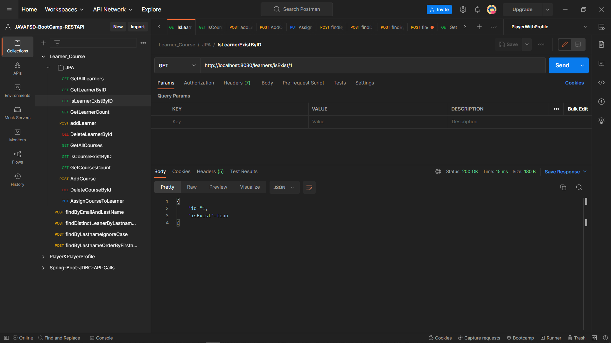

## Get Learner Count - JPA
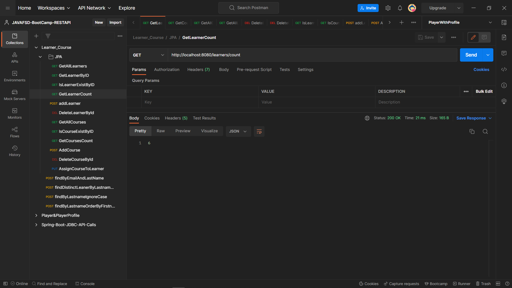

## Add Learner - JPA
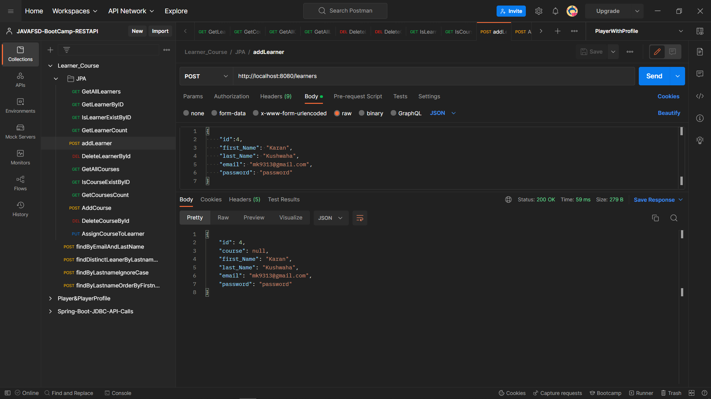

## Delete Learner By ID - JPA
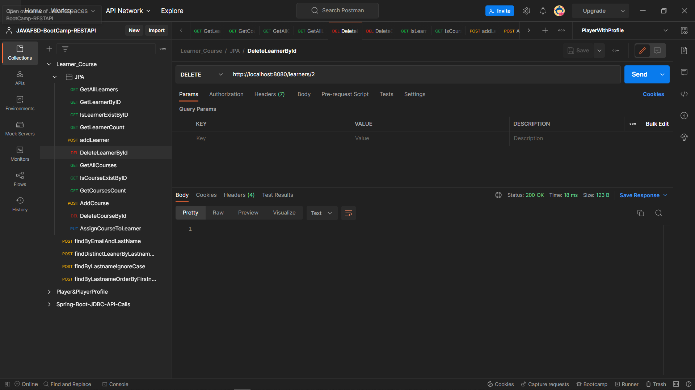

## Get All Courses - JPA
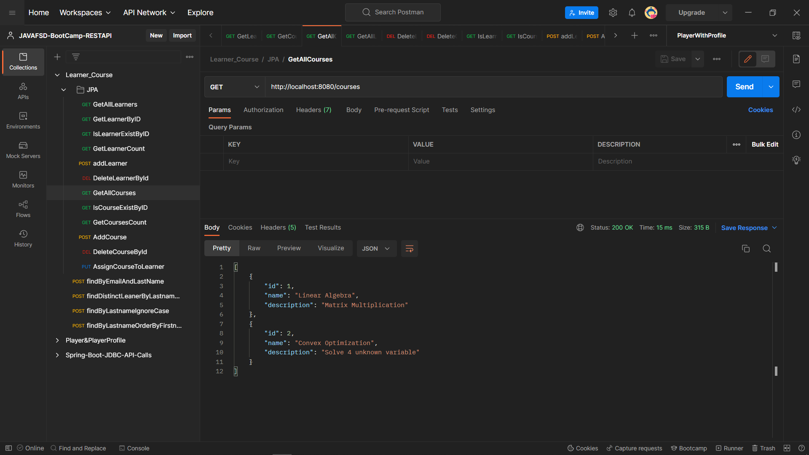

## Get Course By Id - JPA

## Is Course Exist By ID - JPA
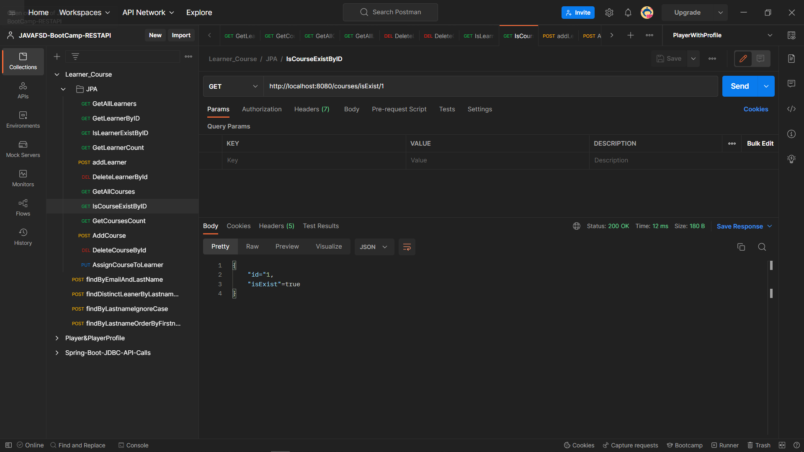

## Get Course Count - JPA
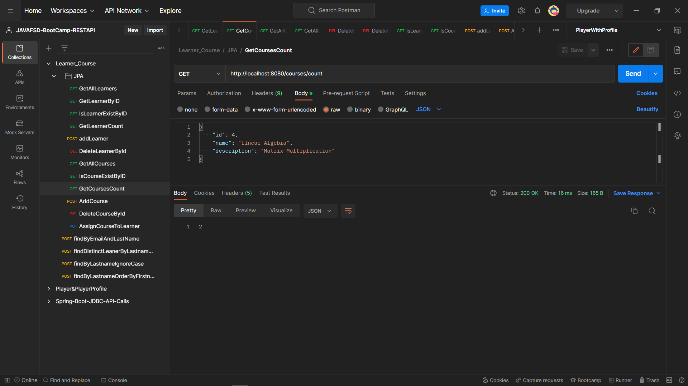

## Add Course - JPA
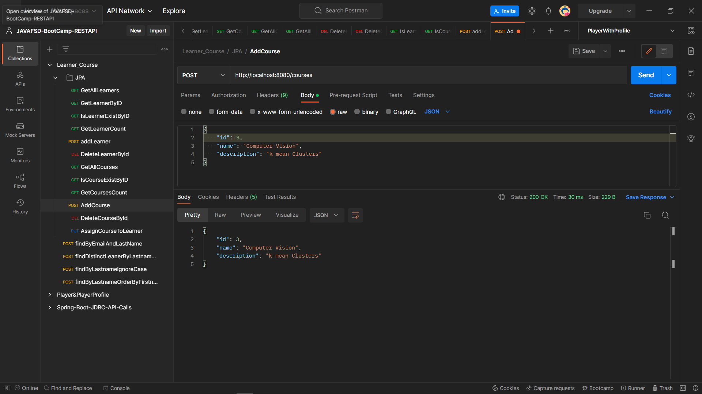

## Delete Course By ID - JPA
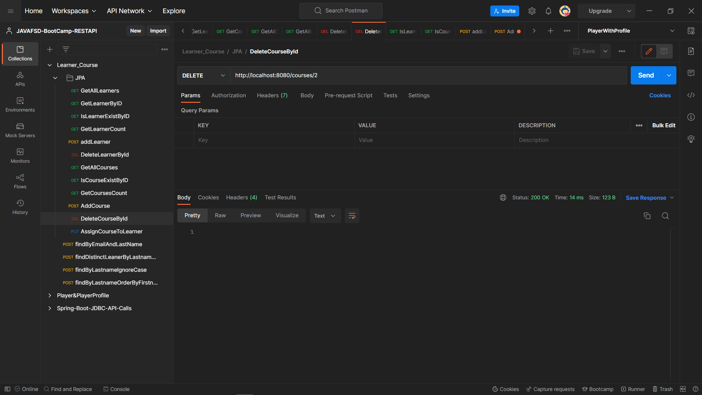

## Assign Course to a Learner - JPA
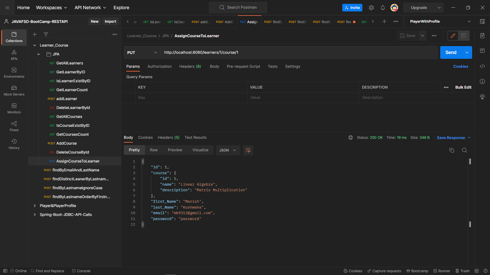

# -------------------- Query Based Rest API using JPARepo extension -------------
## Find By Email Address and Last Name - Query
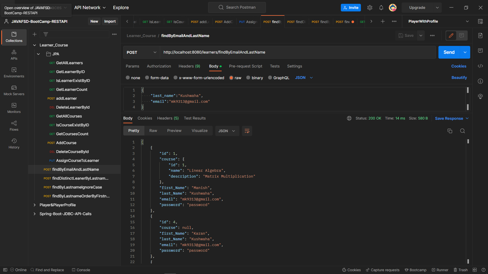

## Find Distinct Learner by last name - Query
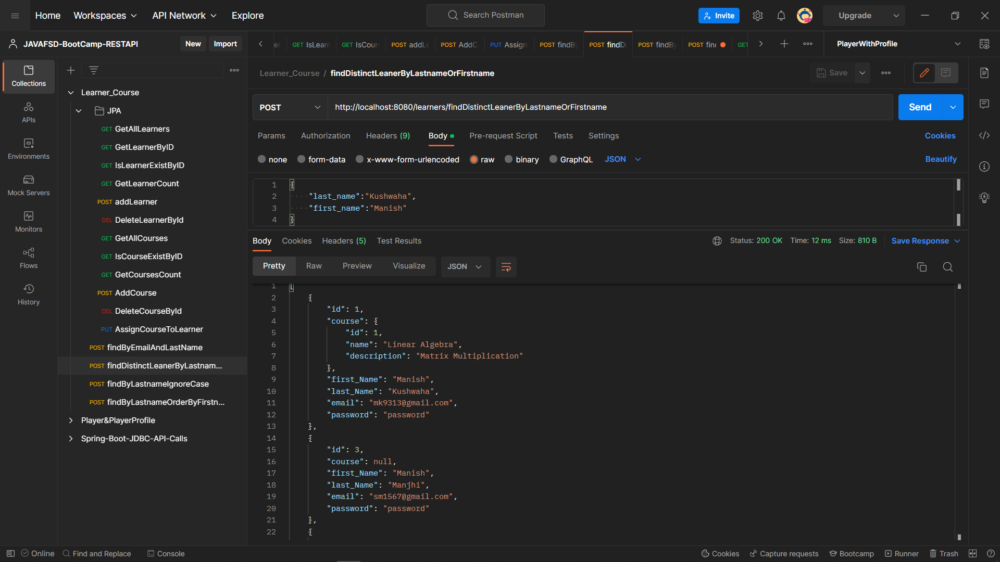

## Find by last name (ignore case) - Query
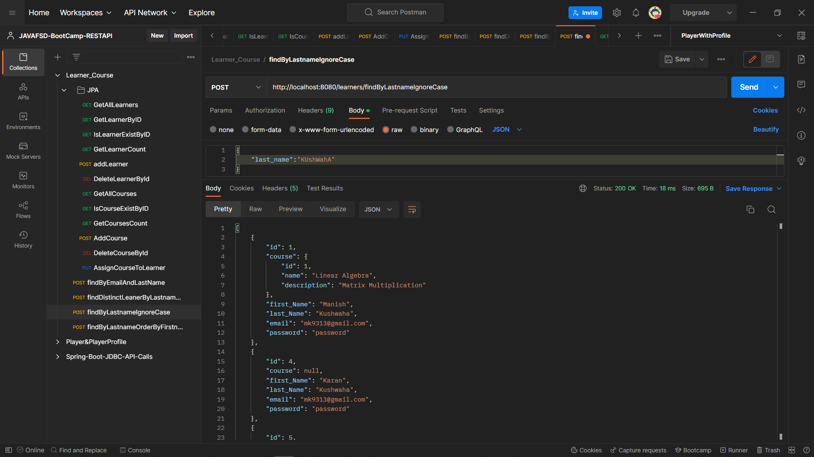

## Find Last Name Order By First Name - Query
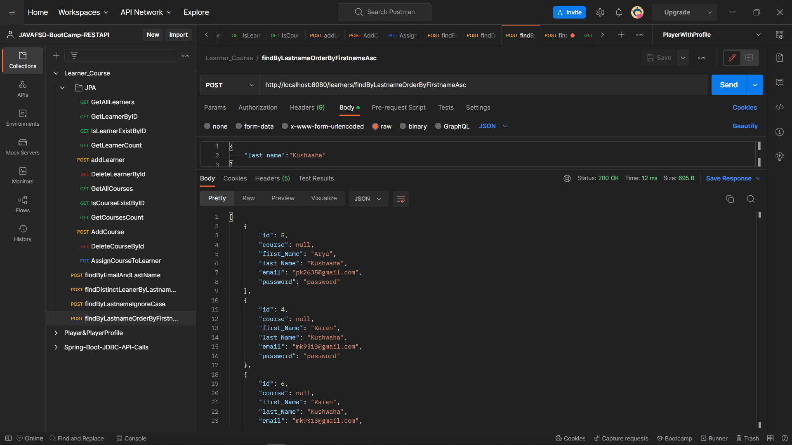

